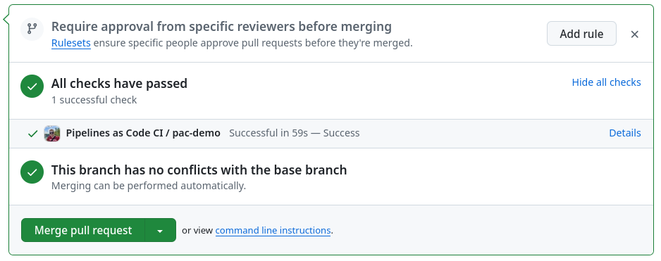
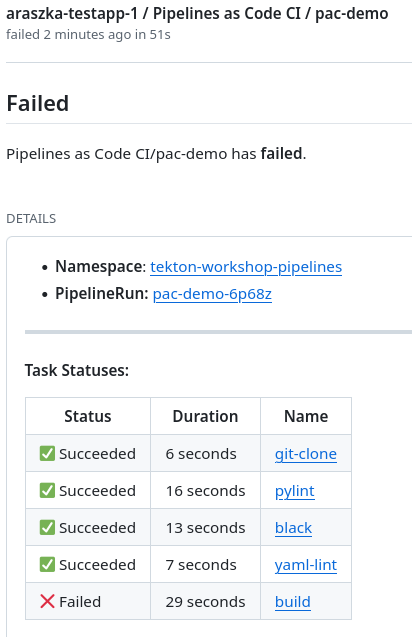
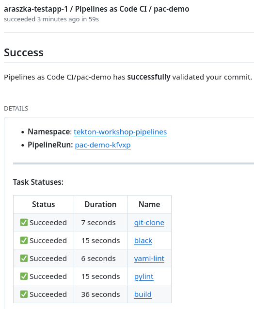

# Tekton workshop

This repository contains a guides and resources needed for getting familiar with Tekton.
The aim is to get you familiar with Tekton and its components and how to use it in your CI/CD workflow.
The workshop is targeted for a user with no or little experience with Tekton. For more advanced users
there is plenty of room to experiment and extend the examples and build custom pipelines.

The workshop is divided into several sections. Each section covers a different aspect of Tekton. At the end of the workshop you should be able to create a simple CI/CD pipeline that runs a test and builds a container image and integrates it with a Github repository.

🚀🚀 Good luck and have fun! 🚀🚀

## Prerequisites
In order to install and run tekton pipelines we need to have a valid execution environment.
There are couple of options that we can use - Kubernetes, OpenShift, OpenShift Local, Minikube.
All of these will work fine for purpose of this workflow but for a simplicity we will choose
the Minikube.

### Minikube

The Minikube is a local Kubernetes that we can use as a local playground. Before attending
this workshop I highly recommend installing the Minikube and verify it runs fine on your
computer. The guide how to install it and hardware/software requirement can be found [here](https://minikube.sigs.k8s.io/docs/start/?arch=%2Flinux%2Fx86-64%2Fstable%2Fbinary+download)

### Kubectl
To interact with a local Kubernetes cluster you will need `kubectl` cli tool.
To install it on your machine follow an official [doc](https://kubernetes.io/docs/tasks/tools/)

### Tekton CLI
Tekton provides a CLI tool to interact with Tekton resources. To make interaction more smooth I recommend installing `tkn` CLI tool to your system. Follow an [official doc](https://tekton.dev/docs/cli/) to install the tool based on your system.

#### Install Tekton PAC plugin
The Tekton PaC (Pipeline as a Code) plugin will be needed to bootstrap new PaC project. To install the plugin download a version that is compatible with your system from the [releases page](https://github.com/openshift-pipelines/pipelines-as-code/releases) and install it using following command:

```bash
sudo dnf install -y /path/to/tkn-pac-linux-amd64.rpm
```

## Try out Tekton

## Install Tekton
### Start Minikube cluster

```bash
minikube start
```
This command starts a local Minikube instance. The initial run may take a while.

At the end of the command you should see a similar output to this one:
```bash
😄  minikube v1.33.1 on Fedora 40
✨  Automatically selected the docker driver. Other choices: qemu2, ssh
📌  Using Docker driver with root privileges
👍  Starting "minikube" primary control-plane node in "minikube" cluster
🚜  Pulling base image v0.0.44 ...
🔥  Creating docker container (CPUs=2, Memory=7900MB) ...
🐳  Preparing Kubernetes v1.30.0 on Docker 26.1.1 ...
    ▪ Generating certificates and keys ...
    ▪ Booting up control plane ...
    ▪ Configuring RBAC rules ...
🔗  Configuring bridge CNI (Container Networking Interface) ...
🔎  Verifying Kubernetes components...
    ▪ Using image gcr.io/k8s-minikube/storage-provisioner:v5
🌟  Enabled addons: storage-provisioner, default-storageclass

❗  /home/araszka/bin/kubectl is version 1.27.4, which may have incompatibilities with Kubernetes 1.30.0.
    ▪ Want kubectl v1.30.0? Try 'minikube kubectl -- get pods -A'
🏄  Done! kubectl is now configured to use "minikube" cluster and "default" namespace by default
```

To verify system is up and running try to run following command:
```
$ kubectl get po -A                                                                                                                                                                                                                                                             ✔ │ 44s  │ minikube ⎈ │ 10:43:51 
NAMESPACE     NAME                               READY   STATUS    RESTARTS      AGE
kube-system   coredns-7db6d8ff4d-56rkv           1/1     Running   0             2m7s
kube-system   etcd-minikube                      1/1     Running   0             2m21s
kube-system   kube-apiserver-minikube            1/1     Running   0             2m21s
kube-system   kube-controller-manager-minikube   1/1     Running   0             2m21s
kube-system   kube-proxy-vmvqs                   1/1     Running   0             2m7s
kube-system   kube-scheduler-minikube            1/1     Running   0             2m21s
kube-system   storage-provisioner                1/1     Running   1 (97s ago)   2m19s
```

#### Install Tekton on a cluster
The Tekton can be installed using multiple ways. For purpose of this demo we are going to use
an official k8s release. Execute following command to apply Tekton resources.
```bash
$ kubectl apply --filename https://storage.googleapis.com/tekton-releases/pipeline/latest/release.yaml
```
Monitor a progress of an installation using following command:
```bash
kubectl get pods --namespace tekton-pipelines --watch
```
When all components show 1/1 under the READY column, the installation is complete. Hit Ctrl + C to stop monitoring.

#### Install Tekton Dashboard
Tekton dashboard serves as a web user interface and monitoring tool that allows us to have a better overview about running pipelines. To install it run a following command:
```bash
kubectl apply --filename https://storage.googleapis.com/tekton-releases/dashboard/latest/release.yaml
```

Monitor a progress of an installation using following command:
```bash
kubectl get pods --namespace tekton-pipelines --watch
```

To expose the web interface we also need to forward the application. It can be done few ways and we will use
```bash
$ kubectl port-forward -n tekton-pipelines service/tekton-dashboard 9097:9097
```
You can add `&` at the end of the command to run it in a background.

Now the UI is exposed and available at
```
http://localhost:9097
```

### Tekton Tasks
First we are going to create a simple task that will print a message to the console. The task is defined in a `/resources/01-task/hello-world.yaml` file.

I suggest to read the file and understand the structure of the task. The task is a simple yaml file that contains a definition of a task. The task is a sequence of steps that are executed in a given order.

To apply the task to the cluster run following command:
```bash
$ kubectl apply --filename resources/01-task/hello-world.yaml
```

Now we can run the task using `tkn` cli tool. The command to run the task is:
```bash
$ tkn task start hello --showlog

TaskRun started: hello-run-v98sc
Waiting for logs to be available...
[echo] Hello World

[echo-again] Hello Again
```

### Tekton Pipelines
The task is a single unit of work. The pipeline is a sequence of tasks that are executed in a given order. The pipeline is defined in a `/resources/02-pipeline/hello-world-pipeline.yaml` file.

The example pipeline is made of two tasks. The first task is the same as the one we created before. The second task is a `goodbye` task that prints a message to the console with a given argument.

To apply the pipeline and tasks to the cluster run following command:
```bash
$ kubectl apply --filename resources/02-pipeline/goodbye.yaml

$ kubectl apply --filename resources/02-pipeline/hello-world-pipeline.yaml
```

Now we can run the pipeline using `tkn` cli tool. The command to run the pipeline is:
```bash
$ tkn pipeline start hello-goodbye --showlog --param username=araszka

PipelineRun started: hello-goodbye-run-x4g7l
Waiting for logs to be available...
[hello : echo] Hello World

[hello : echo-again] Hello Again

[goodbye : goodbye] Goodbye araszka!
```

### Parameters
Parameters and results are a way how to pass a value to or from a task or a pipeline. In this section we are going to create a tasks that accepts a parameter and a pipeline that passes a value to and from the tasks.

Checkout a resources in a `/resources/03-parameters` directory. The directory contains a sample pipeline and tasks. Update the pipeline and the tasks based on the comments in the files. Resources
available at `resources/02-pipeline` might give you hints how to work with parameters and results.

Here are some useful links that can help you to understand how to work with parameters and results:

 - [Pipeline parameters](https://tekton.dev/docs/pipelines/pipelines/#specifying-parameters)
 - [Task parameters](https://tekton.dev/docs/pipelines/tasks/#specifying-parameters)
 - [Task results](https://tekton.dev/docs/pipelines/tasks/#emitting-results)
 - [Passing results between tasks](https://tekton.dev/docs/pipelines/pipelines/#passing-one-tasks-results-into-the-parameters-or-when-expressions-of-another)

After you're done with an implementation apply tasks and pipeline and run it

```bash
$ kubectl apply -f resources/03-params-and-results/task-01.yaml
$ kubectl apply -f resources/03-params-and-results/task-02.yaml
$ kubectl apply -f resources/03-params-and-results/param-and-results-pipeline.yaml

$ tkn pipeline start param-and-results --showlog --param "git_url=https://example.com/foo.git" --param "git_revision=main"
```
### Workspaces
Similar to parameters and results [workspace](https://tekton.dev/docs/pipelines/workspaces/) are a way how to pass a data to tasks. There are several ways how to use a workspace but we are going to focus on sharing a workspace between tasks as a shared volume.

The volume is mounted to a task and task can read and write data to the volume.

Let's use it in real example. Checkout a resources in a `/resources/04-workspaces` directory. The directory contains a sample pipeline and `reader` and `writer` task. Update the pipeline and the tasks based on the comments in the files.

To apply tasks and pipeline and run it use following commands:

```bash
$ kubectl apply -f resources/04-workspaces/read-task.yaml
$ kubectl apply -f resources/04-workspaces/write-task.yaml
$ kubectl apply -f resources/04-workspaces/workspace-pipeline.yaml

$ kn pipeline start workspace-pipeline \
    --showlog \
    --workspace "name=shared-workspace,volumeClaimTemplateFile=resources/07-ci-cd-pipeline/workspace-template.yaml"
```

As you can see the volume is mounted to both tasks and the data is shared between them.

Additional --workspace option defines how the volume is created. The volume is created as a VolumeClair using a template file.

### Matrix
The matrix is a way how to run a task multiple times with different parameters. The matrix is defined in a pipeline and the task is executed for each combination of parameters. This can often be seen in a testing scenarios where a task is executed for each version of a software or when building it for multiple architecture.

```bash

$ kubectl apply -f resources/05-matrix/test-task.yaml
$ kubectl apply -f resources/05-matrix/matrix-pipeline.yaml

$ tkn pipeline start matrix-pipeline --showlog

PipelineRun started: matrix-pipeline-run-bn2ll
Waiting for logs to be available...
[test-task : test] Testing on macos!
[test-task : test] Testing on windows!
[test-task : test] Testing on linux!
[test-task : test] Test completed on macos!

[test-task : test] Test completed on windows!

[test-task : test] Test completed on linux!

```

From the output you can see that the task is executed for each operating system given in the matrix.

### TektonHub
As a user of Tekton you can use a TektonHub to find and use pre-built tasks and pipelines. The TektonHub is a repository of reusable tasks and pipelines that can be used in your projects. The TektonHub is available at [hub.tekton.dev](https://hub.tekton.dev/)

As an example we are going to use a `curl` task from the TektonHub. The task is available at [hub.tekton.dev](https://hub.tekton.dev/tekton/task/curl). Follow the instructions on the page to install the task to your cluster. Then execute the task using `tkn` cli tool.

```bash
tkn task start curl --showlog --param url=http://www.example.com/index.html
```

Feel free to install any other task from the TektonHub and experiment with it.


### CI/CD pipeline
Given what we have learned so far let's create a simple CI/CD pipeline that runs a test and builds a docker image.
It us up to you whether your build a pipeline from scratch or use a TektonHub to find a pre-built tasks (Hint: all tasks are available at TektonHub).

The pipeline should have following steps:
 - Clone the repository
 - Run the tests
    - Run black linter
    - Run yaml linter
    - Run pytest
    - Run pylint
 - Build the docker image using a Buildah
 - Push the docker image to a registry (optional step if you have an access to a registry)

For those who would like to go extra mile you can create an extra step that will deploy the image to a mini-kube cluster and expose the API.

Use a [current repository](https://github.com/Allda/tekton-workshop.git) as an input for the pipeline.

After you're done with an implementation execute the pipeline using `tkn` cli tool.

```bash
tkn pipeline start ci-cd-pipeline \
    --showlog \
    --workspace "name=shared-workspace,volumeClaimTemplateFile=resources/07-ci-cd-pipeline/workspace-template.yaml" \
    -p git_url="https://github.com/Allda/tekton-workshop.git" \
    -p git_revision=main
```

### Pipeline-As-Code
One of the way how to integrate tekton into your CI/CD workflow is to use a Pipeline-As-Code approach.
The Pipeline-As-Code is a way how to define a pipeline in a code and store it in a repository.
The Tekton provides a `tkn` cli tool and `pac` plugin that can be used to bootstrap a new PaC project.

The PaC is fully integrated with a Github workflow and can be used to trigger a pipeline on a push or pull request.

Let's build a custom PaC and integrate it with a Github repository. First fork this repository under your Github account and use the fork for the PaC project.


There is an already nicely written a guide how to integrate a PaC with a Github repository.
The guide can be found [here](https://pipelinesascode.com/docs/install/getting-started/). Follow the guide and setup a PaC for your forked repository.



Failed pipeline            |  Passed pipeline
:-------------------------:|:-------------------------:
 |  

To test if your PaC works open a new pull request withing your forked repository and check if the pipeline is triggered. You can also make intentional linting error to test if a pipeline fails.
